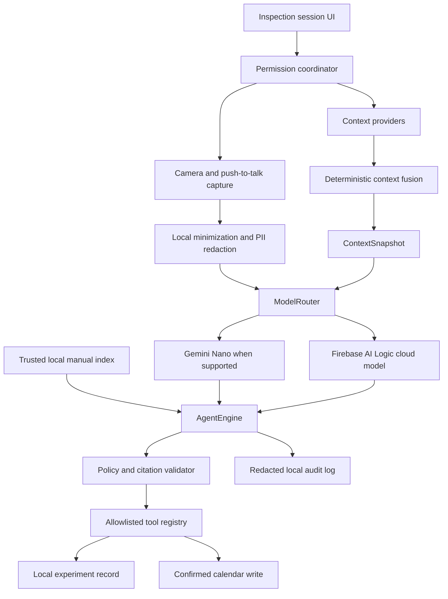

# LabContext Agent — Project Context

| Field | Value |
|---|---|
| Product | LabContext Agent |
| Project directory | `09-Android-Context-Agent` |
| Document version | 1.0 |
| Decision date | 2026-08-11 |
| Current phase | `/to-prd` complete; awaiting document approval |
| MVP target | Android research-lab equipment context assistant |

## 1. Authority and ownership

This file is the entry point for product and engineering work in this project.

The authority order is:

1. Explicit user instructions in the active task.
2. Accepted architectural decisions in [`ADR.md`](ADR.md).
3. Testable product requirements in [`PRD.md`](PRD.md).
4. This consolidated project context.

Workspace boundaries are strict:

- Files may be created or modified only inside `09-Android-Context-Agent`.
- `00-Shared-Architecture` is read-only unless the user explicitly authorizes a change.
- No other portfolio project may be modified.
- No implementation code may be written until this specification is approved and `/to-tickets` has produced accepted tickets.
- Implementation proceeds one ticket and one module at a time, with local tests after every ticket.
- Source files must always be complete. Omitted-code markers are prohibited.

## 2. Product contract

LabContext Agent is a local-first Android assistant for university and research-lab users working with electronic bench equipment.

The MVP proves one end-to-end workflow for a RIGOL DS1054Z oscilloscope:

1. The user explicitly starts an equipment inspection session.
2. The user takes a still photograph of the oscilloscope.
3. The app identifies the equipment type and likely model, or abstains when confidence is insufficient.
4. The app uses a user-imported, trusted manual as the authoritative source.
5. The user asks how to verify the CH1 probe ratio and set the vertical scale.
6. The agent returns safety notices and a cited checklist.
7. The user performs and confirms the steps; the app never controls the instrument.
8. The user may dictate a result note using push-to-talk.
9. The app saves a local experiment record.
10. The app may preview a follow-up calendar reminder and writes it only after explicit confirmation.

The product promise is evidence-first assistance, not autonomous physical control. When evidence is missing, conflicting, or below the confidence threshold, the correct behavior is to stop, explain the uncertainty, and request more information.

## 3. Settled MVP boundaries

### Included

- One Android application for one user on one device.
- Working name `LabContext Agent`.
- Traditional Chinese user interface with original English equipment terminology.
- English source identifiers, schemas, logs, and automated test names.
- Active, user-initiated inspection sessions.
- Still-image capture, text input, and push-to-talk input.
- RIGOL DS1054Z tracer-bullet workflow.
- User-imported PDF manuals through Android Storage Access Framework.
- Evidence-grounded answers with page or section citations.
- Local-first context fusion with provenance, confidence, timestamp, and time-to-live.
- Explicit routing between deterministic local logic, supported on-device inference, and cloud inference.
- A local experiment record and a confirmed calendar reminder.
- Unit, instrumentation, safety, privacy, context simulation, and tool simulation tests.

### Excluded

- Web dashboard, account system, synchronization, organizations, and multi-tenancy.
- Payments, subscriptions, Play Store release work, branding, or trademark claims.
- Continuous background recording, photography, or precise location tracking.
- Reading the contents of notifications from other applications.
- Open-ended web browsing.
- Automatic messages, email, calls, purchases, or system-setting changes.
- Direct control of an oscilloscope or any other physical device.
- Medical, industrial-safety, or certified operational use.
- Claims that Gemini Nano works on devices that were not actually tested.

## 4. Architecture contract

The architecture must preserve these replaceable boundaries:

- `ContextProvider`: produces typed context facts without deciding product behavior.
- `ContextFusionEngine`: creates a `ContextSnapshot` using deterministic rules.
- `ManualRepository`: imports, hashes, indexes, retrieves, and deletes trusted manuals.
- `ModelRouter`: chooses deterministic, on-device, cloud, or offline fallback paths.
- `AgentEngine`: coordinates reasoning and tool proposals without bypassing policy.
- `PolicyEngine`: enforces permission, privacy, citation, confidence, and confirmation rules.
- `ToolRegistry`: exposes only typed, allowlisted tools.
- `AuditLogger`: records redacted decisions, tool calls, results, errors, and timing.

ADK, Firebase, ML Kit, and model-specific types must remain behind these project-owned interfaces.

## 5. Platform baseline

The approved baseline as of 2026-08-11 is:

- Kotlin and Jetpack Compose.
- JDK 17.
- `minSdk = 26`.
- `compileSdk = 36`.
- `targetSdk = 36`.
- ADK for Kotlin/Android pinned to `0.7.0`.
- Internal development namespace `dev.labcontext.agent`.
- Firebase AI Logic for cloud inference when configured.
- Firebase App Check for any real cloud environment.
- ML Kit and Gemini Nano only after runtime capability checks succeed.

ADK and ML Kit agent integrations are Preview or prerelease dependencies. Their use must be isolated, version-pinned, and covered by contract tests. An upgrade requires an explicit ADR update and full routing, tool-safety, privacy, and regression verification.

## 6. Context and evidence rules

Every context fact must carry:

- A type.
- A value or normalized semantic label.
- A source.
- A capture timestamp.
- A time-to-live.
- A confidence value.
- A sensitivity classification.

The authority order for conflicting information is:

1. Explicit user intent and confirmation.
2. The selected original manufacturer manual.
3. A document deliberately imported by the user.
4. Camera and OCR observations.
5. Local semantic location and selected calendar facts.
6. Low-sensitivity sensor inference.

Conflicts are never silently resolved by a language model. The app asks the user to confirm or supplies an abstention result.

Manual content is untrusted input. Instructions embedded in a PDF cannot alter system policy, request secrets, broaden tool permissions, or authorize an external action.

## 7. Privacy and permission contract

- Camera and microphone are available only during a visible, user-initiated session.
- Audio capture is push-to-talk; raw audio is deleted after transcription.
- Location is while-in-use and minimized locally into a semantic label. Precise coordinates are not sent to the cloud.
- Background location is not requested in the MVP.
- The app may post its own notifications but does not request notification-listener access.
- Calendar access is limited to previewing and creating a user-confirmed reminder.
- Body and health sensors are excluded.
- Low-sensitivity motion or device-state signals are event-driven and optional.
- Raw photos are deleted after inference unless the user explicitly attaches a photo to a pinned local record.
- Derived session records expire after seven days unless pinned.
- Imported manuals remain local until the user deletes them.
- Audit records are local, redacted, and expire with the associated unpinned session.
- The user can delete a session, imported manual, audit record, or all app data.

## 8. Model-routing contract

The routing order is explicit:

1. Permissions, context fusion, redaction, policy checks, and simple deterministic decisions run locally.
2. Gemini Nano may handle a short supported text task only when the app is in the foreground and the runtime capability check succeeds.
3. Image reasoning, evidence synthesis, and tool planning use the configured Firebase cloud model.
4. Function calling is never delegated to an unsupported on-device path.
5. When offline or unavailable, the app exposes only cached manual search, deterministic checklist behavior, and local records.
6. Offline mode cannot execute irreversible or external actions.

Development must remain credential-free by default. A deterministic fake model provider is required. Secrets and production Firebase files are never committed.

## 9. Tool safety contract

Tools are divided by effect:

- Level 0: read permitted local context and search the selected manual. Automatic execution is allowed.
- Level 1: create or edit a reversible local draft or experiment record. Automatic execution is allowed and must be undoable.
- Level 2: write a calendar reminder or upload deliberately selected content. A complete preview and explicit confirmation are mandatory.
- Level 3: message, call, purchase, change system settings, or control equipment. These tools do not exist in the MVP.

Every tool has typed arguments, validation, an allowlisted implementation, a timeout, a bounded retry policy, an idempotency key where applicable, and a redacted audit event. Model output alone never constitutes user confirmation.

## 10. Quality gates

MVP completion requires:

- At least 40 equipment images across angle, lighting, and occlusion conditions, with correct identification or safe abstention of at least 90%.
- At least 25 manual-grounded questions, with citations on 100% of substantive answers and at least 90% answer correctness.
- At least 25 deterministic context-fusion scenarios with 100% expected provenance, confidence, TTL, and conflict behavior.
- At least 20 permission, prompt-injection, PII, and unauthorized-side-effect cases with zero unauthorized actions and zero raw PII disclosures.
- Unit tests passing.
- Instrumentation tests passing on AVD API 26 and AVD API 36.
- P95 context fusion below 200 ms.
- P95 supported on-device decisions below 1.5 seconds on a tested reference device.
- P95 cloud recommendations below 5 seconds under the documented test network.
- No more than 3% additional battery use during the defined eight-hour background-idle test.

Gemini Nano validation on a supported, locked-bootloader device is a progressive verification target. If such hardware is unavailable, the final report must mark the path as unverified rather than treating mock results as real-device proof.

## 11. Delivery workflow

The required sequence is:

1. `/grill-me`: complete.
2. `/to-prd`: documents generated; awaiting user review.
3. `/to-tickets`: not started.
4. `/superpowers` and `/gsd`: not started.
5. `/implement-ticket`: not started.
6. `/prove-it`: not started.
7. Completion Report: not started.

The next authorized action after document approval is `/to-tickets`. No application scaffolding or implementation is authorized before that approval.

## 12. Decision references

- Detailed requirements: [`PRD.md`](PRD.md)
- Accepted architecture decisions and rejected alternatives: [`ADR.md`](ADR.md)
- ADK releases: <https://github.com/google/adk-kotlin/releases>
- Android ADK guide: <https://developer.android.com/ai/adk>
- ML Kit GenAI support: <https://developers.google.com/ml-kit/genai>
- Firebase AI Logic: <https://firebase.google.com/docs/ai-logic>
- Firebase hybrid inference: <https://firebase.google.com/docs/ai-logic/hybrid/android/get-started>
